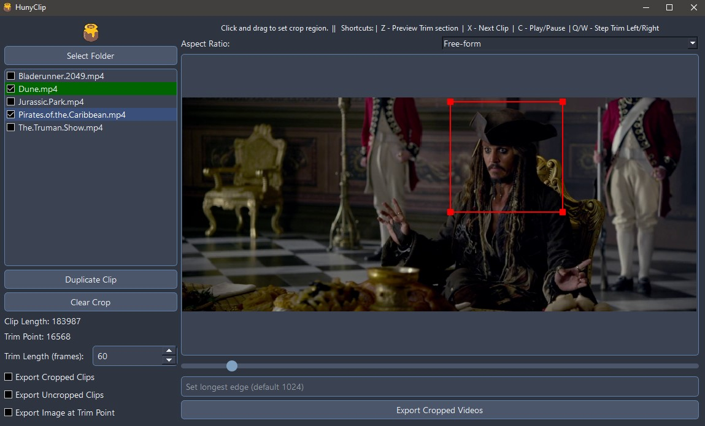

# VidTrainPrep

**VidTrainPrep** is a Python-based tool designed for clipping and preparing video data, specifically tailored for creating datasets for training video models like **LORA, Wan, or Hunyuan**. It allows for precise range selection, cropping, FPS conversion, and optional AI-powered description generation using the Gemini API.

**Acknowledgement:** This tool is a significant refactoring and enhancement based on the original [HunyClip by Tr1dae](https://github.com/Tr1dae/HunyClip).

 
*(Note: Screenshot might be slightly outdated)*

## Key Features

*   **Range-Based Clipping:** Define multiple start/end points (ranges) within a single source video, instead of just one trim point.
*   **Interactive Range Creation:** Create new clip ranges visually by drawing a crop rectangle on the desired start frame. The duration set in the UI is used to determine the end frame.
*   **Independent Range Cropping:** Assign a unique crop region to each defined range.
*   **FPS Conversion Tool:** Pre-process videos in a selected folder by converting them to a target FPS (e.g., 30 FPS) into a new subfolder, crucial for training consistency.
*   **Gemini Integration (Optional):**
    *   Automatically generate descriptions for exported video ranges using the Gemini API (requires API key), helpful for creating captions or prompts.
    *   Optionally prepend a custom **Trigger Word** (e.g., `MyLoraTag, ...`) to generated descriptions/captions.
    *   Optionally provide a **Character Name** to be included in the prompt sent to Gemini for more personalized descriptions.
*   **Flexible Export Options:**
    *   Export cropped video clips.
    *   Export uncropped video clips (full frame, but timed to the range).
    *   Export an image frame from the start of each selected range.
*   **Modern UI:** Refreshed dark monochrome theme.
*   **Session Saving:** Remembers the selected folder, defined ranges, and export settings.
*   **Keyboard Shortcuts:** For faster navigation and editing.

## Installation (Windows Focus)

### Prerequisites

*   **Python:** 3.8 or higher recommended. Download from [python.org](https://www.python.org/). Ensure Python and Pip are added to your system's PATH during installation.
*   **FFmpeg:** Required for video processing (cropping, FPS conversion). 
    *   Download from [ffmpeg.org](https://ffmpeg.org/download.html) (e.g., the `gyan.dev` builds for Windows).
    *   Extract the downloaded archive.
    *   **Crucially, add the `bin` directory** (containing `ffmpeg.exe`, `ffprobe.exe`) **to your system's PATH environment variable.** You can find guides online on how to add directories to the PATH on Windows.
*   **Git:** Optional, but recommended for cloning. Download from [git-scm.com](https://git-scm.com/).

### Steps

1.  **Clone or Download:**
    *   **Using Git (Recommended):**
        ```bash
        git clone https://github.com/lovisdotio/VidTrainPrep.git # Replace with your repo URL if forked
        cd VidTrainPrep
        ```
    *   **Download ZIP:** Download the repository ZIP from GitHub, extract it, and open a terminal (like Command Prompt or PowerShell) in the extracted folder.

2.  **Run the Setup Script:**
    *   Double-click the `Start.bat` file.
    *   This script will automatically:
        *   Create a Python virtual environment (`venv` folder).
        *   Activate the environment.
        *   Install all required Python packages (PyQt6, ffmpeg-python, google-generativeai, Pillow, etc.) from `requirements.txt`.
        *   Launch the application (`main.py`).

## Usage Workflow

1.  **Select Folder:** Click `Select Folder` and choose the directory containing your source videos.
2.  **(Optional) Convert FPS:**
    *   Click `Convert FPS...`.
    *   Enter the desired Target FPS (e.g., 30) and a name for the output subfolder (e.g., `converted_30fps`).
    *   Click `OK`. The conversion process will run in the background (check console output).
    *   Once complete, the application will automatically reload using the new subfolder.
3.  **Load Video:** Click a video name in the "Video Files" list.
4.  **Define Clip Ranges:**
    *   **Navigate:** Use the slider to find the desired start frame for your first clip.
    *   **Set Duration:** Enter the desired clip duration (in frames) in the "Duration (f)" field.
    *   **Create Range by Cropping:** Click and drag on the video preview to define the crop region. When you release the mouse, a new range will be added to the "Clip Ranges" list, starting at the current frame, using the specified duration, and including the crop you drew.
    *   **Create Range without Cropping:** Click the `Add Range Here` button. This adds a range at the current frame with the specified duration, but *without* a crop.
    *   **Repeat:** Navigate to other start frames, adjust duration, and draw crops (or click `Add Range Here`) to define all the ranges you need from this source video.
5.  **Manage Ranges:**
    *   **Select:** Click a range in the "Clip Ranges" list to view/edit its properties.
    *   **Adjust Duration:** Select a range and modify the "Duration (f)" field. The end frame is calculated automatically.
    *   **Update Crop:** Select a range and simply draw a new crop rectangle on the video. The selected range's crop will be updated.
    *   **Clear Crop:** Select a range and click `Clear Crop for Selected Range`.
    *   **Remove:** Select a range and click `Remove Range`.
    *   **Preview:** Select a range and press `Z` to loop playback within that range.
6.  **Configure Export Options:**
    *   **Checkboxes:** Select whether to export cropped clips, uncropped clips, and/or an image from the start frame of each range.
    *   **(Optional) Output Res:** Set a maximum longest edge for exported videos (requires FFmpeg scaling).
    *   **(Optional) Filename Prefix:** Enter text to replace the original filename part.
    *   **(Optional) Trigger Word:** Enter a word/tag to prepend to Gemini descriptions (e.g., `mydata, ...`).
    *   **(Optional) Character Name:** Enter the subject's name to include in Gemini prompts.
    *   **(Optional) Gemini:** Enter your Gemini API Key and check "Generate Gemini..." to enable AI descriptions/captions.
7.  **Select Videos for Export:** In the main "Video Files" list, **check the box** next to each video source whose defined ranges you want to export.
8.  **Export:** Click `Export Selected Video(s)`. The application will process each checked video, exporting files for each of its defined ranges into the `cropped` and/or `uncropped` subfolders based on your settings.

## Keyboard Shortcuts

*   **Z**: Preview (Loop) selected range.
*   **C**: Play/Pause normal playback from current position.
*   **X**: Select Next Video in the main list.
*   **A / S**: Nudge Start Frame Left / Right (of selected range - updates duration).
*   **Q / W**: Nudge End Frame Left / Right (by changing duration).
*   **Delete / Backspace**: Remove selected range (when range list has focus).

## Contributing

Contributions or suggestions are welcome! Please fork the repository and create a pull request with your changes.

## Acknowledgments

*   Original HunyClip concept and base: [Tr1dae](https://github.com/Tr1dae)
*   PyQt6 for the GUI framework.
*   OpenCV and FFmpeg (via ffmpeg-python) for video processing.
*   Google Gemini API (via google-generativeai) for AI descriptions.
